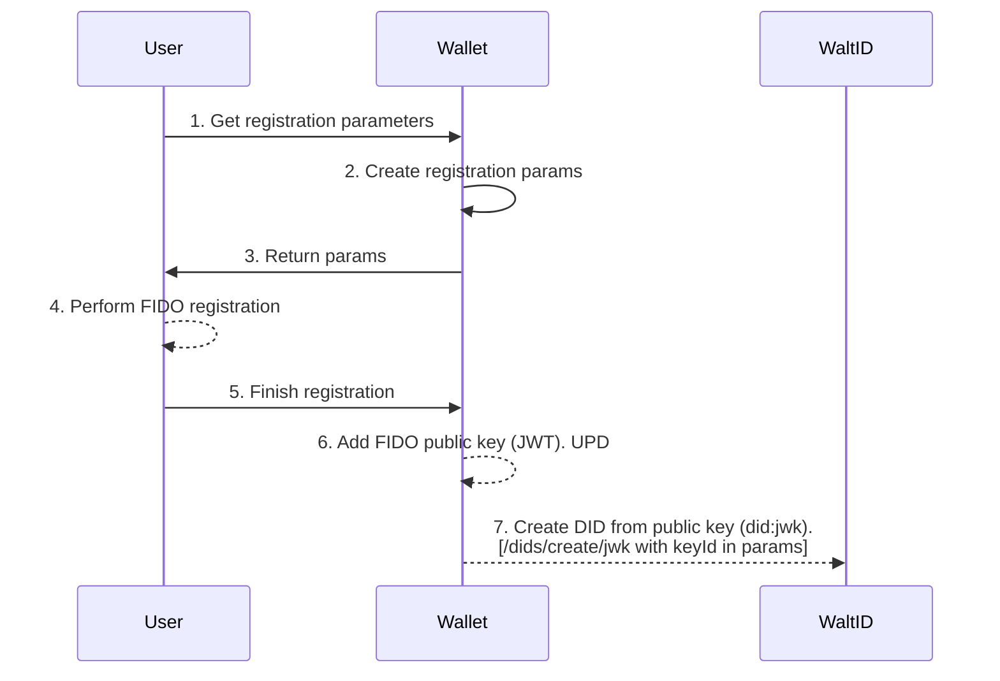
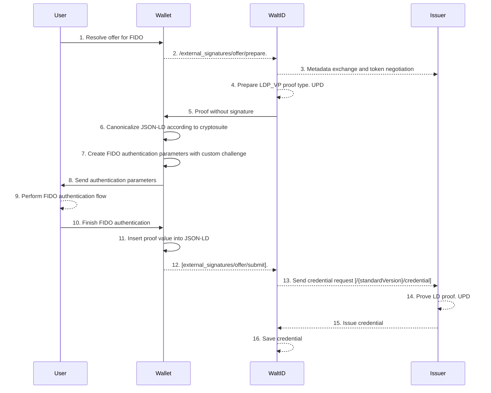
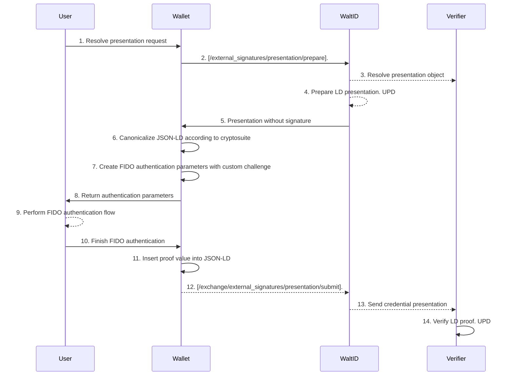

# Flows
## 1. Key Registration Flow

```mermaid
sequenceDiagram
    participant U as User
    participant W as Wallet
    participant WA as WaltID

    U->>W: 1. Get registration parameters
    W->>W: 2. Create registration params
    W->>U: 3. Return params
    U-->>U: 4. Perform FIDO registration
    U->>W: 5. Finish registration
    W-->>W: 6. Add FIDO public key (JWT). UPD
    W-->>WA: 7. Create DID from public key (did:jwk). <br/> [/dids/create/jwk with keyId in params]
```

## 2. Credential Issuance Flow

```mermaid
sequenceDiagram
    participant U as User
    participant W as Wallet
    participant WA as WaltID
    participant I as Issuer

    U->>W: 1. Resolve offer for FIDO
    W-->>WA: 2. /external_signatures/offer/prepare.
    WA-->>I: 3. Metadata exchange and token negotiation
    WA-->>WA: 4. Prepare LDP_VP proof type. UPD
    WA->>W: 5. Proof without signature
    W->>W: 6. Canonicalize JSON-LD according to cryptosuite
    W->>W: 7. Create FIDO authentication parameters with custom challenge
    W->>U: 8. Send authentication parameters
    U-->>U: 9. Perform FIDO authentication flow
    U->>W: 10. Finish FIDO authentication
    W->>W: 11. Insert proof value into JSON-LD
    W-->>WA: 12. [external_signatures/offer/submit]. 
    WA-->>I: 13. Send credential request [/{standardVersion}/credential]
    I-->>I: 14. Prove LD proof. UPD
    I-->>WA: 15. Issue credential
    WA-->>WA: 16. Save credential
```

## 3. Credential Verification Flow

```mermaid
sequenceDiagram
    participant U as User
    participant W as Wallet
    participant WA as WaltID
    participant V as Verifier

    U->>W: 1. Resolve presentation request 
    W->>WA: 2. [/external_signatures/presentation/prepare].
    WA-->>V: 3. Resolve presentation object
    WA-->>WA: 4. Prepare LD presentation. UPD
    WA->>W: 5. Presentation without signature
    W->>W: 6. Canonicalize JSON-LD according to cryptosuite
    W->>W: 7. Create FIDO authentication parameters with custom challenge
    W->>U: 8. Return authentication parameters
    U-->>U: 9. Perform FIDO authentication flow
    U->>W: 10. Finish FIDO authentication
    W->>W: 11. Insert proof value into JSON-LD
    W-->>WA: 12. [/exchange/external_signatures/presentation/submit].
    WA-->>V: 13. Send credential presentation
    V->>V: 14. Verify LD proof. UPD
```

---
